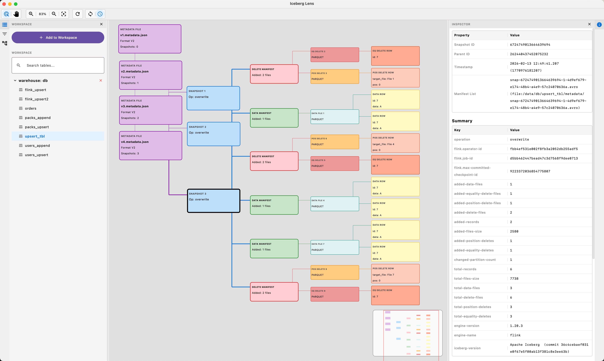
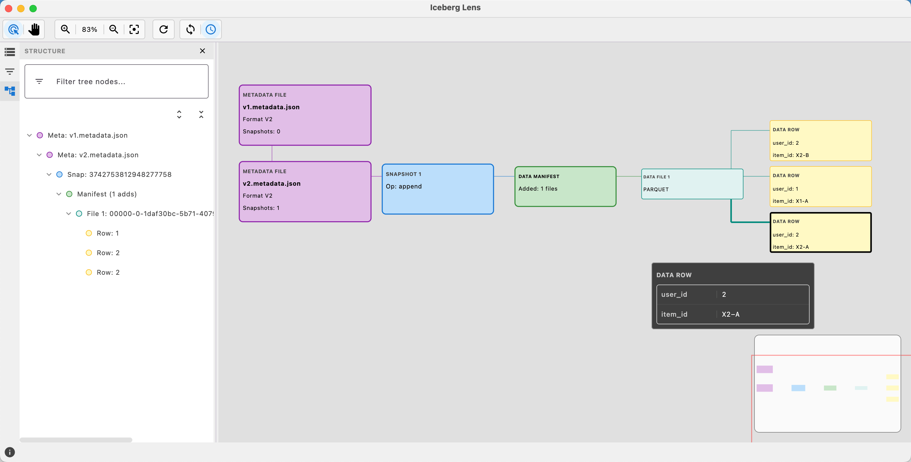

# Iceberg Lens

Simple desktop UI to inspect Apache Iceberg table structure.

It helps you see:

- metadata
- snapshots
- manifests
- data files
- sample rows

This project is built with Kotlin + Compose Desktop.




## Why this project

Iceberg metadata is powerful, but not easy to read quickly from raw files.
Iceberg Lens gives a visual graph + inspector view so teams can understand table structure faster.

## Main features

- Interactive graph for Iceberg structure
- Inspector panel with detailed node info + direct parent/child relations
- Workspace tree for multiple warehouses/tables
- Movable panes (left/right/top/bottom)
- Re-apply layout button
- Reload table from filesystem
- Optional auto-reload when metadata files change

## Quick start

### Requirements

- Java 17+ (JDK)

### Run

```bash
./gradlew run
```

### Build

```bash
./gradlew build
```

## Quick usage

1. Click **Add to Workspace**.
2. Choose a warehouse folder or a single table folder.
3. Select a table from the Workspace panel.
4. Explore graph nodes.
5. Click a node to see details in **Inspector**.

Useful toolbar actions:

- **Re-apply Layout**: reset node layout after manual dragging
- **Reload from Filesystem**: reload table metadata/data
- **Auto Reload**: keep checking metadata changes automatically

## 简体中文（简要）

`Iceberg Lens` 是一个桌面工具，用来快速查看 Iceberg 表结构。

你可以看到：

- metadata
- snapshots
- manifests
- data files
- sample rows

快速开始：

```bash
./gradlew run
```

基本使用：

1. 点击 **Add to Workspace** 添加仓库或表目录。
2. 在 Workspace 里选择一个表。
3. 在图上点击节点，在 Inspector 查看详细信息。

常用按钮：

- **Re-apply Layout**：重新排版图布局
- **Reload from Filesystem**：从文件系统重新加载
- **Auto Reload**：自动检测变化并刷新

## License

Apache-2.0. See `LICENSE`.
