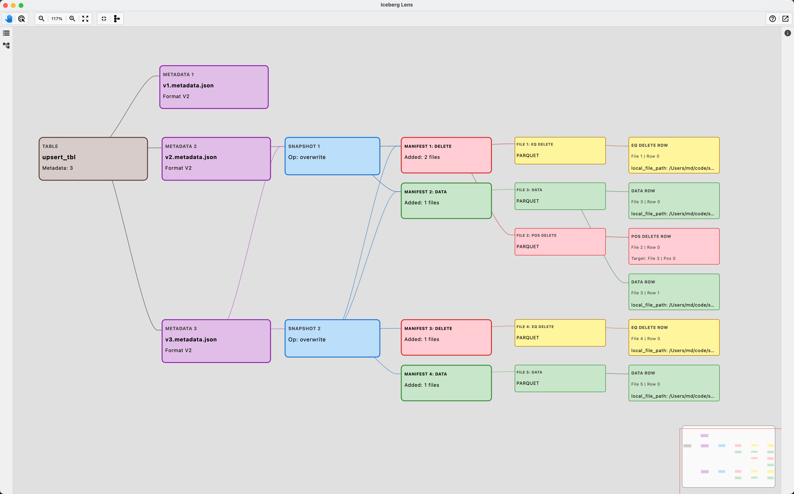
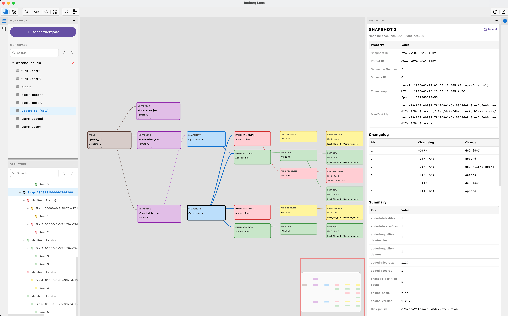
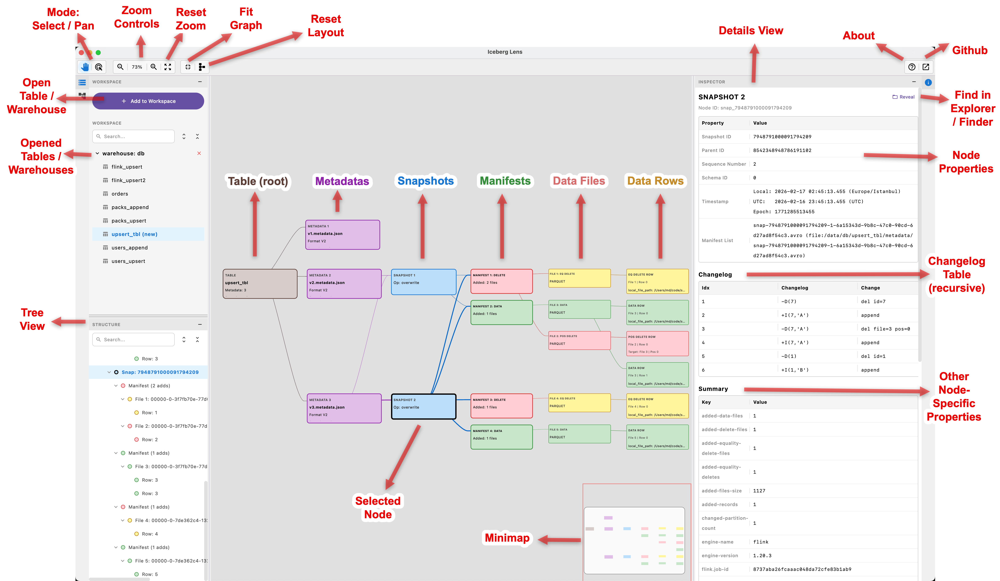

# Iceberg Lens

Read-only desktop UI to inspect Apache Iceberg table structure (local filesystem).

It helps you see:

- metadata
- snapshots
- manifests
- data files
- delete files (equality / position)
- sample rows
- changelogs on each level to track changes over time

This project is built with Kotlin + Compose Desktop.

## Scope / safety

- **Read-only**: Iceberg Lens does not modify tables or metadata.
- **Local-first**: loads tables from folders on your machine (useful for debugging).
- **Offline-friendly**: works without external services/catalogs.

## Screenshots

### Fullscreen



### Overview



### Cheatsheet



## Why this project

Iceberg metadata is powerful, but not easy to read quickly from raw files.
Iceberg Lens provides an interactive **graph + inspector** so you can understand table structure
faster and debug changes without manually opening metadata/manifest files.

## Main features

- Interactive graph for Iceberg structure
- Inspector panel with detailed node info + direct parent/child relations
- Workspace tree for multiple warehouses/tables
- Movable panes (left/right/top/bottom)
- Re-apply layout button
- Auto-reload table from filesystem
- Changelog tables on each level to track changes over time
- Opening multiple tables / warehouses in the same workspace

## Quick start

### Requirements

- Java 17+ (JDK)

### Download (recommended)

Prebuilt installers are available on *
*[GitHub Releases](https://github.com/mmdemirbas/ice-lens/releases)**:

- macOS: `.dmg`
- Windows: `.msi`
- Linux: `.deb`

### Run

```bash
./gradlew run
```

### Build

```bash
./gradlew build
```

## Quick usage

1. Click **Add to Workspace**.
2. Choose a warehouse folder or a single table folder.
    - Warehouse folder = contains multiple tables
    - Table folder = contains metadata/ and data files
3. Select a table from the Workspace panel.
4. Explore graph nodes.
5. Click a node to see details in **Inspector**.

Useful toolbar actions:

- **Re-apply Layout**: reset node layout after manual dragging
- **Fit Graph**: auto-zoom & scroll to fit graph in view

## Limitations (current)

- Local filesystem only (no catalog integrations / remote object stores yet).
- “Sample rows” is intended for debugging and may be best-effort depending on file
  availability/format.
- Reading sample rows scans files and will be slow on large tables.

## Roadmap (ideas)

- Implement different layout options
- Optimize performance for large tables
- Make available as an IntelliJ IDEA plugin
- Search + filters (partition, content type, file name)
- Export (graph / node details)
- Snapshot diff / compare
- Optional remote support (S3/HDFS/ADLS) if there is demand

## Release (GitHub)

You do not need to commit binaries into Git history.
Release assets are built by GitHub Actions and uploaded to GitHub Releases.

### One command

```bash
./release.sh 1.0.1
```

Script steps:

1. Check working tree is clean
2. Check `build.gradle.kts` version matches input
3. Run local build check
4. Create git tag `v1.0.1`
5. Push branch + tag
6. Trigger release workflow to build:
    - macOS `.dmg`
    - Windows `.msi`
    - Linux `.deb`

## 中文概要

用于检查 Apache Iceberg 表结构（本地文件系统）的只读桌面 UI。

它可以帮助您查看：

- 元数据
- 快照
- 清单
- 数据文件
- 删除文件（相等/位置）
- 示例行

### 运行

```bash
./gradlew run
```

### 快速使用方法

1. 点击**添加到工作区**。
2. 选择一个仓库文件夹或单个表文件夹。
3. 从工作区面板中选择一个表。
4. 浏览图节点。
5. 点击节点以在**检查器**中查看详细信息。

### 实用工具栏操作：

- **重新应用布局**：手动拖动后重置节点布局
- **调整图大小**：自动缩放和滚动以适应视图

### 限制（当前）

- 仅限本地文件系统（暂不支持目录集成/远程对象存储）。
- “示例行”仅用于调试，可能因文件可用性/格式而异，无法保证其准确性。

## License

Apache-2.0. See `LICENSE`.
